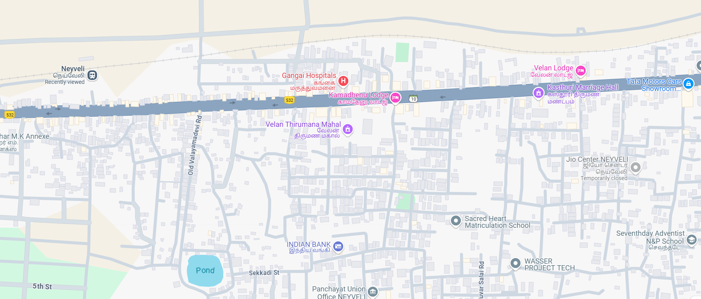

# Ex04 Places Around Me
## Date: 29-04-2025

## AIM
To develop a website to display details about the places around my house.

## DESIGN STEPS

### STEP 1
Create a Django admin interface.

### STEP 2
Download your city map from Google.

### STEP 3
Using ```<map>``` tag name the map.

### STEP 4
Create clickable regions in the image using ```<area>``` tag.

### STEP 5
Write HTML programs for all the regions identified.

### STEP 6
Execute the programs and publish them.

## CODE
~~~
map.html

<html>
    <head>
        <title>My City</title>
    </head>
    <body>
        <h1 align="center">
            <font color="red"><b>Neyveli</b></font>
        </h1>
        <h3 align="center">
            <font color="blue"><b>Kirutika KR (212224230128)</b></font>
        </h3>
        <center>
            
            <map name="MyCity">
            <area shape="rect" coords="100,100,900,900" href="home.html" title="My Home Town">
            
            <area target="" alt="Gangai Hospitals" title="Gangai Hospitals" href="Hospital.html" coords="699,172,867,219" shape="rect">
            <area target="" alt="Kamadhenu Lodge" title="Kamadhenu Lodge" href="Lodge.html" coords="814,228,999,267" shape="rect">
            <area target="" alt="Velan Thirumana Mahal" title="Velan Thirumana Mahal" href="Mahal.html" coords="652,296,898,354" shape="rect">
            <area target="" alt="Indian Bank" title="Indian Bank" href="Bank.html" coords="706,589,871,644" shape="rect">
            <area target="" alt="Seventhday Adventist N&amp;P School" title="Seventhday Adventist N&amp;P School" href="School.html" coords="1526,558,1757,644" shape="rect">
</map>
            </map>
        </center>
    </body>
</html>

Bank.html


<html>
<body bgcolor="orange">
    <h1 align="center">
        <font  size="10" color="red">
            Neyveli
        </font>
    </h1>
    <h2 align="center">
        
       Indian Bank
    
    </h2>
    <hr>
    <h3>
        <center> 
        
        </center>
        <br>
        <hr>
        <li>
            <font size="4">
                The Indian Bank in Neyveli, Tamil Nadu, operates a branch at 12/3 Main Bazaar, Block 12, Neyveli, 607803.
                 
                 
        <li>
            <font size="4">
                The IFSC code for this branch is IDIB000N024, and it is open Monday to Saturday from 10 AM to 4 PM, with the
                 2nd and 4th Saturdays being non-working days.
                
            </font>
        </li>
        <br>
        <li>
            <font size="4">
                The Indian Bank in Neyveli, Tamil Nadu, operates a branch at 12/3 Main Bazaar, Block 12, Neyveli, 607803. 
                The IFSC code for this branch is IDIB000N024, and it is open Monday to Saturday from 10 AM to 4 PM, with the 2nd and 4th Saturdays being non-working days.

 
            </font>
        </li>
    </h3>
</body>

School.html

<html>
<body bgcolor="green">
    <h1 align="center">
        <font  size="10" color="red">
            Neyveli
        </font>
    </h1>
    <h2 align="center">
        
      Seventhday Adventist N&P School
    
    </h2>
    <hr>
    <h3>
        <center> 
        
        </center>
        <br>
        <hr>
        <li>
            <font size="4">
                It's located on National Highway 532, near Gangaikondan and Mandharakuppam, Neyveli 2
        </li>
        <br>
        <li>
            <font size="4">
                The opening time on working days is 8 AM. Closing hours may vary, so we recommend confirming directly with Seventh Day Adventist Higher Secondary School.
        </li>
        <br>
        <li>
            <font size="4">
                Our dedicated and knowledgeable staff is committed to providing you with the best guidance.
   
            </font>
        </li>
    </h3>
</body>

Mahal.html

<html>
<body bgcolor="yellow">
    <h1 align="center">
        <font  size="10" color="red">
            Neyveli
        </font>
    </h1>
    <h2 align="center">
        
       Velan Thirumana Mahal
    
    </h2>
    <hr>
    <h3>
        <center> 
        
        </center>
        <br>
        <hr>
        <li>
            <font size="4">
                Velan Thirumana Mandapam specializes in hosting a variety of events, offering ample space for large gatherings as well as intimate celebrations.  
                
        </li>
        <br>
        <li>
            <font size="4">
                t might offer a few well-maintained rooms or suites for the bride, groom, and their immediate families to get ready and relax during the event.
            </font>
        </li>
        <br>
        <li>
            <font size="4">
                Adequate parking space for the guests' vehicles is usually a priority for such venues.
 
            </font>
        </li>
    </h3>
</body>

Lodge.html

<html>
<body bgcolor="violet">
    <h1 align="center">
        <font  size="10" color="red">
            Neyveli
        </font>
    </h1>
    <h2 align="center">
        
        Kanadhenu Lodge
    
    </h2>
    <hr>
    <h3>
        <center> 
        
        </center>
        <br>
        <hr>
        <li>
            <font size="4">
                Near Jayapriya Busstop, Mandarakuppam, Neyveli, Cuddalore. It is approximately 39 km away from Cuddalore city center. 
                
        </li>
        <br>
        <li>
            <font size="4">
                It's a 2-star property offering air-conditioned rooms with TVs. A continental breakfast is available. Parking is available.
            </font>
        </li>
        <br>
        <li>
            <font size="4">
               
                Reach out to the lodge management via phone to inquire about their facilities, services, pricing, and availability.

 
            </font>
        </li>
    </h3>
</body>

Hospital.html

<html>
<body bgcolor="pink">
    <h1 align="center">
        <font  size="10" color="red">
            Neyveli
        </font>
    </h1>
    <h2 align="center">
        
        Gangai Hospitals   

    </h2>
    <hr>
    <h3>
        <center> 
        
        </center>
        <br>
        <hr>
        <li>
            <font size="4">
                Gangai Hospitals in Neyveli 2 is a private, 24-hour hospital offering a range of healthcare services.
                
               
                
        </li>
        <br>
        <li>
            <font size="4">
                It's located on National Highway 532, near Gangaikondan and Mandharakuppam, Neyveli 2.
               
                
        </li>
        <br>
        <li>
            <font size="4">
                The hospital is accessible to people with disabilities, with wheelchair-friendly entrances and parking. 

                
            </font>
        </li>
    </h3>
</body>

~~~


## OUTPUT



## RESULT
The program for implementing image maps using HTML is executed successfully.
